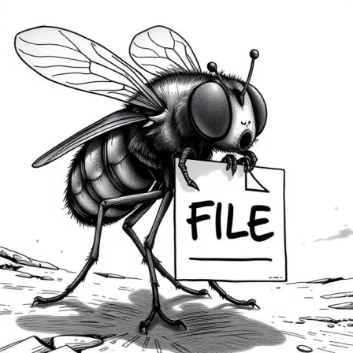

# File-Flea



**File-Flea** is a simple, lightweight PHP-based file upload and sharing system. It allows users to upload files via a web interface, provides a downloadable URL, and includes optional features like authentication and automatic file cleanup. The project is designed for easy deployment and customization.

## Features
- **File Upload**: Upload files with client-side and server-side validation.
- **Download Links**: Generates unique URLs for downloading uploaded files.
- **Authentication**: Optional token-based authentication for secure uploads.
- **Automatic Cleanup**: Deletes files older than a specified duration (configurable).
- **Progress Tracking**: Displays upload progress in real-time.
- **Copy to Clipboard**: Easily copy the generated download URL.
- **Simple Interface**: Minimalist HTML/CSS design with a focus on functionality.

## Requirements
- **PHP**: Version 7.4 or higher (with `finfo` extension for MIME type detection).
- **Web Server**: Apache, Nginx, or any server supporting PHP.
- **Permissions**: Write access to the upload directory.

## Installation

1. **Clone the Repository**:
   ```bash
   git clone https://github.com/cronin-cyber/file-flea.git
   cd file-flea
   ```
- Or download `ZIP` file from Releases.

2. **Set Up the Upload Directory**:
- Ensure the `uploads/` directory exists and is writable by the web server.
- The `config.php` script will attempt to create it automatically if it doesn’t exist.

3. **Configure the Application**:
- Open `config.php` and adjust the settings (see [Configuration](Configuration) below).
- Example:
   ```php
   $max_file_size = 500; // 500 MB
   $upload_folder = 'uploads/';
   $enable_authentication = true;
   $auth_tokens = ['admin', 'user1token'];
   ```

4. **Deploy to a Web Server**:
- Upload the files to your web server (e.g., `/var/www/html/file-flea/`).
- Ensure the server has PHP installed and the upload folder is writable (e.g., `chmod 755 uploads/`).

5. **Test the Setup**:
- Access the site in your browser (e.g., `http://localhost/file-flea/`).
- Upload a small file to verify functionality.

## Usage

1. **Upload a File**:
- Visit the main page (`index.php`).
- Select a file using the file input.
- If authentication is enabled, enter a valid token from `config.php`.
- Click "Upload" to start the process.

2. **Monitor Progress**:
- Watch the progress percentage in the response area during upload.

3. **Get the Download URL**:
- Upon success, a URL will appear in the response area.
- Click "Copy URL" to copy it to your clipboard.

4. **Download a File**:
- Paste the URL in a browser to download the file.
- Files are served directly via `filehandler.php` with proper MIME types.

## Configuration

Edit `config.php` to customize the application:

| Variable                | Description                                         | Default Value           |
|-------------------------|-----------------------------------------------------|-------------------------|
| `$max_file_size`        | Maximum file size allowed (in MB)                   | 500                     |
| `$upload_folder`        | Directory for uploaded files                        | 'uploads/'              |
| `$enable_cleanup`       | Enable automatic cleanup of old files               | true                    |
| `$cleanup_duration`     | Duration in days before files are deleted           | 3                       |
| `$enable_authentication`| Enable token-based authentication                   | true                    |
| `$auth_tokens`          | Array of valid authentication tokens                | ['admin', 'user1token'] |

### Example `config.php`
```php
<?php
$max_file_size = 100;             // 100 MB limit
$upload_folder = 'uploads/';      // Upload directory
$enable_cleanup = true;           // Enable cleanup
$cleanup_duration = 7;            // Files expire after 7 days
$enable_authentication = false;   // Disable authentication
$auth_tokens = ['secret123'];     // Ignored if authentication is disabled
?>
```

## File Structure
```
file-flea/
├── index.php         # Main interface for uploading files
├── filehandler.php   # Handles uploads, downloads, and cleanup
├── config.php        # Configuration settings
└── uploads/          # Directory for uploaded files (create manually or auto-generated)
```

## Security Notes
- **Authentication**: Use strong, unique tokens in `$auth_tokens` if enabled.
- **File Names**: Only basic validation is applied (must start with a letter/number). Consider adding more sanitization to prevent injection attacks.
- Directory Traversal: `basename()` is used to mitigate traversal, but ensure $upload_folder is properly configured.
- HTTPS: Deploy with HTTPS to secure file transfers.
- Permissions: Restrict access to `uploads/` (e.g., via `.htaccess` on Apache) if direct access isn’t desired.

## Contributing
- Fork the repository.
- Create a feature branch (`git checkout -b feature-name`).
- Commit your changes (`git commit -m "Add feature"`).
- Push to the branch (`git push origin feature-name`).
- Open a `pull request`.

## License
This project is licensed under the MIT LICENSE - see the [LICENSE](LICENSE) file for details (create one if desired).

## Acknowledgments
- Built with PHP and vanilla JavaScript for simplicity and portability.
- Inspired by the need for a lightweight file-sharing tool.
